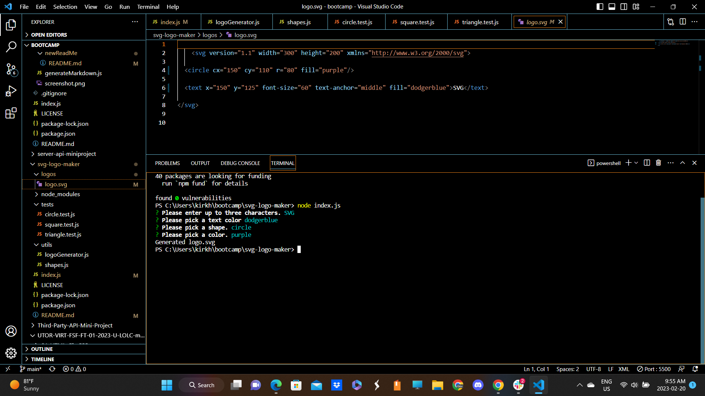

# SVG Logo Maker

  ## Badges
  

  [License Link](https://opensource.org/licenses/MIT)

  ## Description
  In this repository, you will find code for an SVG file logo maker app made using Inquirer, and tested using Jest testing suites. The application opens through Node.js in the command line.

  ## Table of Contents
  
  • [Installation](#installation)

  • [Usage](#usage)

  • [License](#license)

  • [Contributions](#contributions)

  • [Tests](#tests)

  • [Questions](#questions)

  ## Installation
  Installation requirements for this application include several Node libraries - fs, inquirer, and a custom inquirer plugin called inquirer-maxlength-input-prompt. It also requires the jest dev dependency for testing purposes.

  ## Usage
  To use this application, simply open the root directory in the command line, and run the command <node index.js>. This will initialize the Inquirer prompts, which will present the user with several questions to answer in order to generate a custom SVG logo. The newly created logo will appear in a directory called 'logos' inside a file called 'logo.svg'.

   Website URL: http://kirkhagglund.github.io/svg-logo-maker/

  

  ## License
  This project is protected by a standard MIT License. Please see license link for detailed information.
  
  ## Contributions
  If you would like to contribute, please contact through Github or via Email. See links in Questions section.

  ## Tests
  This application ran through three testing suites using Jest, to ensure the shapes and colors rendered properly.

  ## Credits
  Made use of github user jwarby's induirer-maxlength-input-prompt to limit character length to 3. Repository URL: https://github.com/jwarby/inquirer-maxlength-input-prompt

  ## Questions
  [Github Account](https://github.com/KirkHagglund)

  [Email Account](mailto:kirkhagglund@gmail.com)
